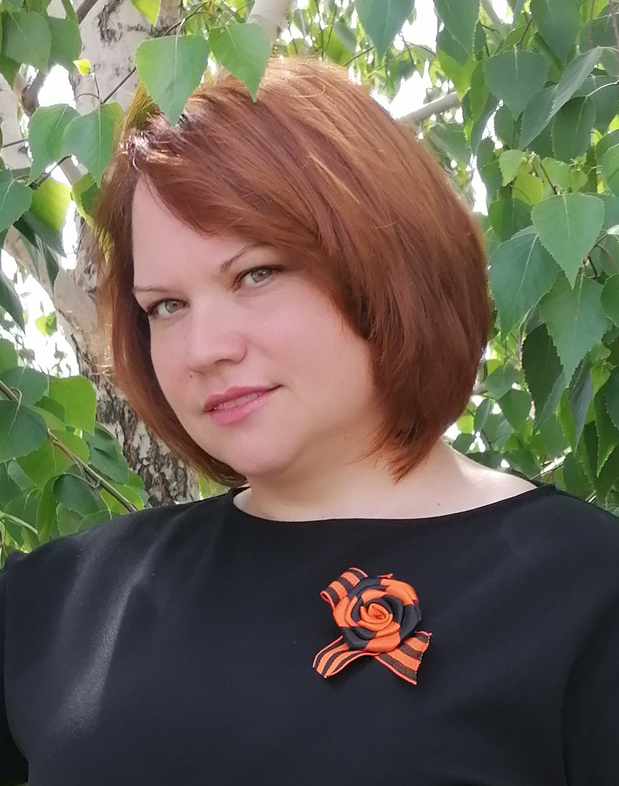

# Всем привет!

Меня зовут **Екатерина**! 
Я являюсь студенткой Нетологии. 
>Люблю программировать. Для меня писать программу, как сочинять музыку, с каждой новым символом рождается произведение.

Увлекаться программированием начала еще в школе. Свои первые программы писала на Basic. Затем закончила колледж и институт по направлению программирования. 11 лет преподавала программирование в колледже. Сейчас повышаю квалификацию, открываю для себя новый мир Python. Никогда не участвовала в реальных проектах, только в учебных, очень хочется это исправить. 
***
Помимо программирования увлекаюсь:
- фотографией 
- рисованием

***
Люблю животных, велопрогулки и отдых в палатках.
